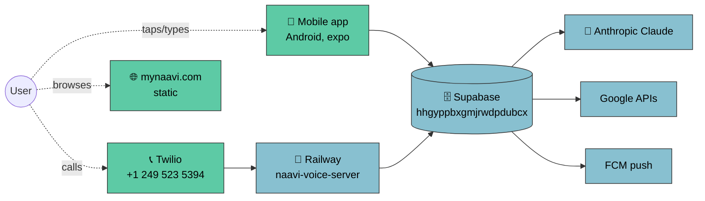
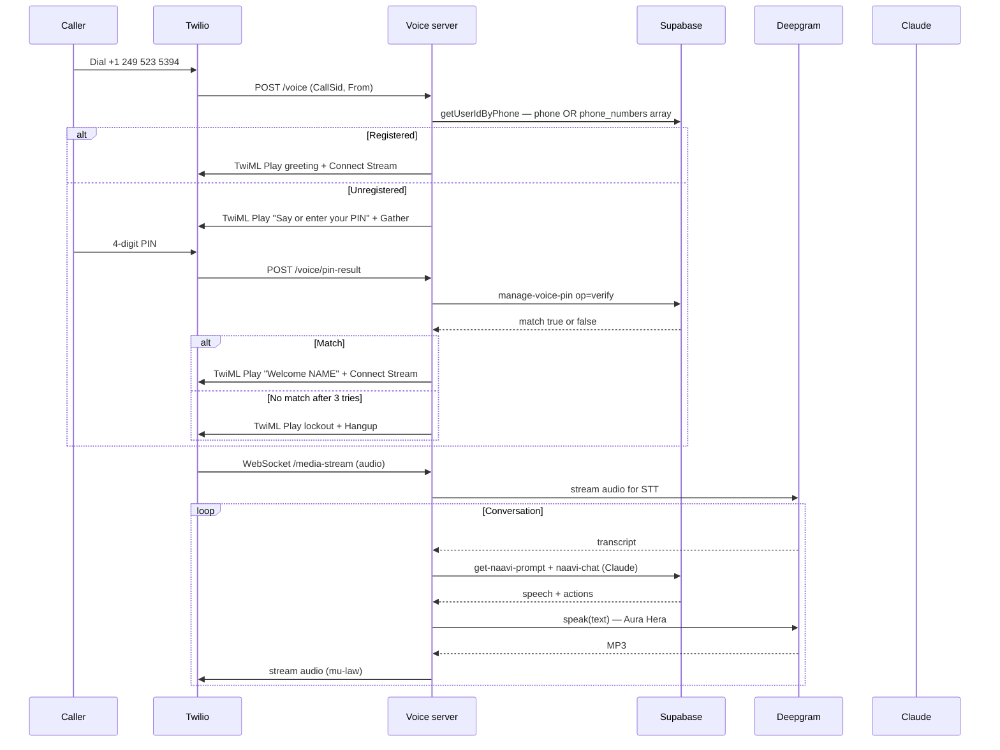
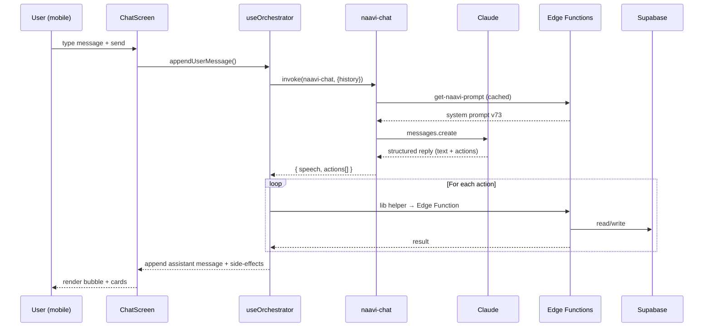
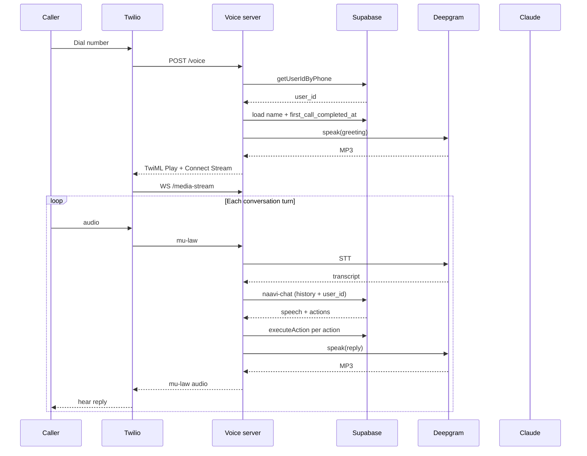
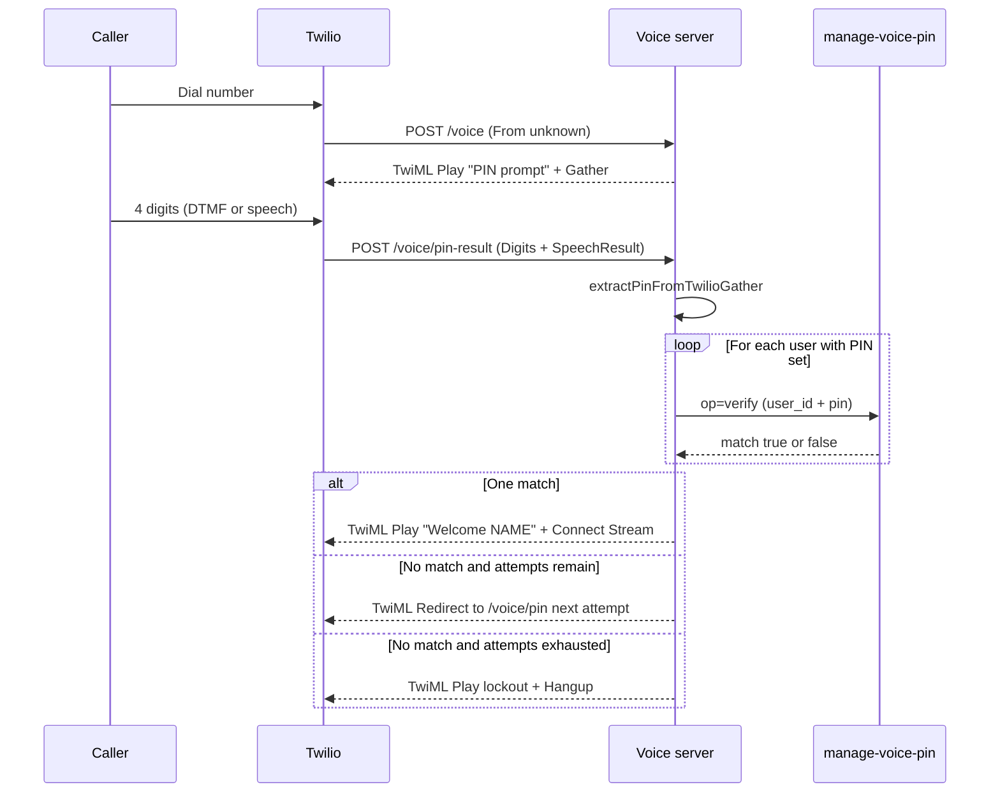
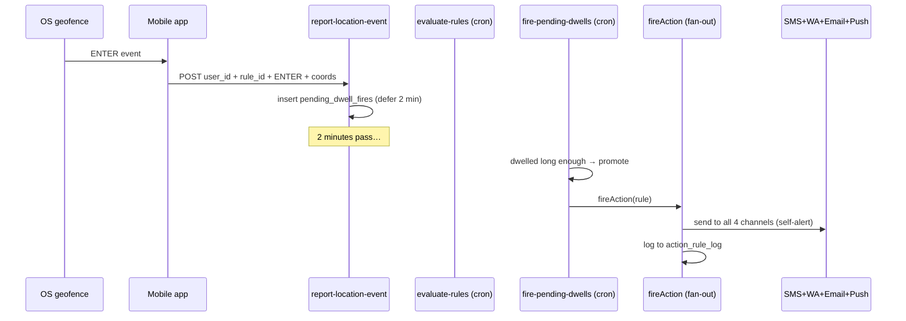
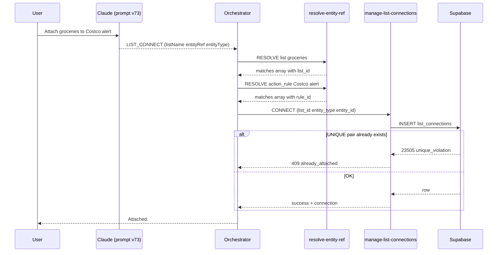
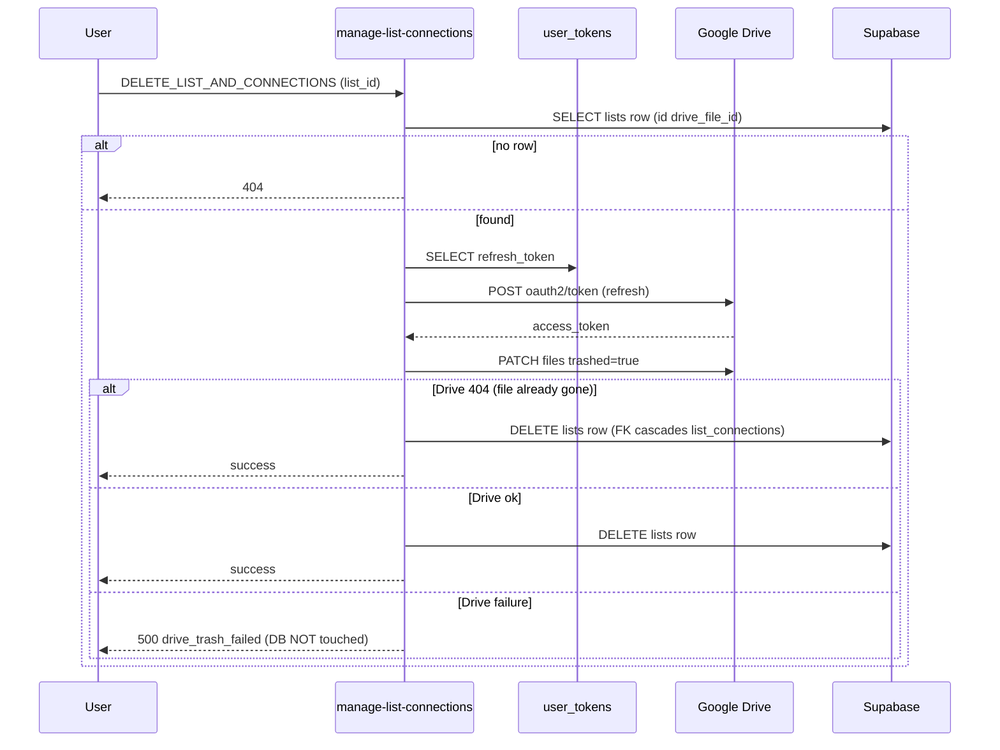
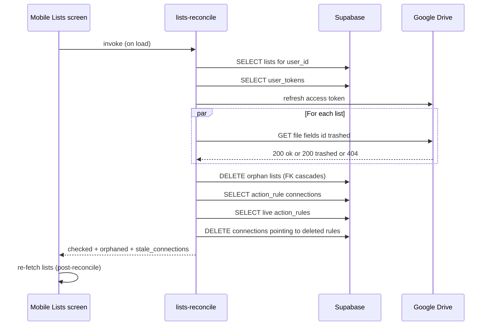
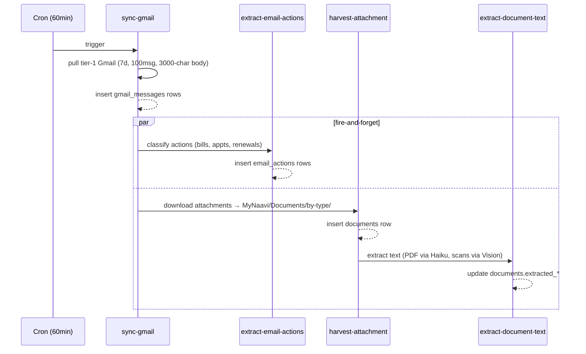

# MyNaavi — Architecture & Wiring

**Snapshot:** V57.15.0 (build 171) · 2026-05-13
**Audience:** Wael (plain-English sections), future Claude sessions (technical sections).
**Source of truth:** the codebase. This doc summarises what is wired *today*; when it disagrees with the code, the code wins. Treat this file as a map, not a contract.

> Wave 2 (Lists UI) + Wave 2.5 (M:N cardinality) + Wave 2.6 (Drive↔DB hard sync) all landed in this session. Multi-phone identity and the off-phone caller PIN flow also went live the same day. See [§13 Recent Changes](#13-recent-changes) for the day's commits.

---

## Table of Contents

- [Part A — Plain English (for Wael)](#part-a--plain-english-for-wael)
  - [1. What MyNaavi is](#1-what-mynaavi-is)
  - [2. The three surfaces](#2-the-three-surfaces)
  - [3. The three repos](#3-the-three-repos)
  - [4. A typical request, end-to-end](#4-a-typical-request-end-to-end)
- [Part B — Technical map](#part-b--technical-map)
  - [5. Mobile app](#5-mobile-app)
  - [6. Voice server](#6-voice-server)
  - [7. Backend (Supabase)](#7-backend-supabase)
  - [8. External services](#8-external-services)
  - [9. Major flows (sequence diagrams)](#9-major-flows-sequence-diagrams)
  - [10. Configuration discipline](#10-configuration-discipline)
  - [11. Quick reference](#11-quick-reference)
  - [12. Known gaps & follow-ups](#12-known-gaps--follow-ups)
  - [13. Recent changes (2026-05-13 session)](#13-recent-changes)

---

# Part A — Plain English (for Wael)

## 1. What MyNaavi is

MyNaavi is a life-orchestration companion that runs across three places at once:

1. **An Android app on your phone** — the visual surface. Chat, screens, notifications.
2. **A phone number you can call from anywhere** — the voice surface. Talk to MyNaavi like a person.
3. **A backend that quietly coordinates everything** — your data, your calendar, your alerts, your lists, all in one place.

The visual app and the phone line share the same data and the same brain. You can attach a list to an alert by voice and see it in the app a second later; you can set an alert in the app and have MyNaavi remind you of it by voice call. There is no "app mode" and "voice mode" — there is only MyNaavi, with two ways to talk to it.

The brain is Claude (Anthropic's AI). Claude is wrapped in a strict system prompt that tells it which tools to use, when to confirm, when to refuse. The prompt lives in **one** place — the `get-naavi-prompt` Edge Function — so the app and the phone line always speak the same MyNaavi.

## 2. The three surfaces



**Mobile (Android only today):** Built with Expo + React Native. Distributed exclusively through Google Play Internal Testing. No iOS yet. No web app (the website is a static marketing site, not an app).

**Voice:** Inbound calls to the Twilio number connect to a Node.js server hosted on Railway. The server streams audio to Deepgram (speech-to-text), feeds the transcript to Claude, then sends Claude's reply through Deepgram Aura (text-to-speech) back to the caller.

**Web:** A static HTML site on Vercel. Marketing only — no Supabase, no auth, no API. Don't confuse it with the app.

## 3. The three repos

| Repo | Purpose | Deploy target |
|---|---|---|
| `munk2207/naavi-app` | Mobile app source + Edge Function source + migrations | EAS/Google Play (app) + Supabase (functions) |
| `munk2207/naavi-voice-server` | Twilio voice call server | Railway (auto-deploy on push) |
| `munk2207/mynaavi-website` | Static marketing HTML | Vercel (auto-deploy on push) |

The mobile app and the voice server **share the Supabase backend**. Anything you save in the app shows up to the voice line, and vice versa. The website doesn't touch Supabase — it's brochure-ware.

Working directory convention: edit on `main` in `C:\Users\waela\OneDrive\Desktop\Naavi` (the OneDrive copy). Build separately from `C:\Users\waela\naavi-mobile` (outside OneDrive, because EAS fails inside OneDrive). Never `cp -f` between them — `git merge` only.

## 4. A typical request, end-to-end

Example — user types *"Attach my groceries list to my Costco alert"* into the mobile chat.

1. **Mobile app** sends the text + conversation history to the `naavi-chat` Edge Function.
2. **`naavi-chat`** loads the shared system prompt from `get-naavi-prompt`, plus brief items / health / knowledge for context, then calls Claude.
3. **Claude** reads the rules (RULE 8b says "list connections" → `list_connect` action), and replies with structured text including `{ type: "LIST_CONNECT", listName: "groceries", entityRef: "Costco alert", entityType: "action_rule" }`.
4. **Mobile orchestrator** (`hooks/useOrchestrator.ts`) sees the LIST_CONNECT, calls `connectList` from `lib/list_connections.ts`.
5. **`connectList`** calls the `resolve-entity-ref` Edge Function twice — once to turn "groceries" into a list ID, once to turn "Costco alert" into an action_rule ID.
6. **`manage-list-connections`** Edge Function writes the new `list_connections` row.
7. **Database** enforces uniqueness via `UNIQUE(list_id, entity_type, entity_id)`. The list is now attached to the alert.
8. **Mobile UI** refreshes from the DB; the alert-detail "Attached lists" card now includes "groceries".
9. **Voice surface** would now also be aware of this attachment: if Wael calls and says *"What lists are on my Costco alert?"*, the voice server hits the same `manage-list-connections` Edge Function and reads back "Your Costco alert has 1 list attached. 1. groceries."

Same flow, same brain, two surfaces.

---

# Part B — Technical map

## 5. Mobile app

### 5.1 Screens (entry points)

Routed by Expo Router; declared in [app/_layout.tsx](../app/_layout.tsx).

| Path | File | Purpose |
|---|---|---|
| `/` | [app/index.tsx](../app/index.tsx) | Home — chat with MyNaavi. Top bar 3-dots menu. |
| `/alerts` | [app/alerts.tsx](../app/alerts.tsx) | Action rules list, with expand → attached-lists card + delete. |
| `/lists` | [app/lists.tsx](../app/lists.tsx) | Lists with All / Attached / Standalone tabs. Reconciles Drive↔DB on load. |
| `/lists/[id]` | [app/lists/[id].tsx](../app/lists/[id].tsx) | List-detail: items + Attached-to: rows + Delete list. |
| `/notes` | [app/notes.tsx](../app/notes.tsx) | Drive Notes view. |
| `/settings` | [app/settings.tsx](../app/settings.tsx) | Profile, voice pref, phone list (primary + backups), connected services. |
| `/help` | [app/help.tsx](../app/help.tsx) | Help text + report a problem entry. |
| `/about` | [app/about.tsx](../app/about.tsx) | Version, legal. |
| `/report` | [app/report.tsx](../app/report.tsx) | Submit a bug. |
| `/contact` | [app/contact.tsx](../app/contact.tsx) | Reach support. |
| `/brief`, `/calendar`, `/contacts`, `/email` | [app/brief.tsx](../app/brief.tsx) etc. | Deep-link landing screens from Google Assistant App Actions. |
| `/permission-location` | [app/permission-location.tsx](../app/permission-location.tsx) | Explainer + "Allow all the time" reminder for location alerts. |

The 3-dots top-bar menu (defined in `app/index.tsx`) lists: **Alerts → Lists → Notes → Info → Help → Settings**.

### 5.2 The chat orchestrator (the central nervous system)

[hooks/useOrchestrator.ts](../hooks/useOrchestrator.ts) is the single mobile-side dispatcher. Every user message:

1. Goes to the orchestrator.
2. Orchestrator calls `naavi-chat` Edge Function (Claude path).
3. Claude returns structured actions (`SAVE_TO_DRIVE`, `LIST_CONNECT`, `SET_ACTION_RULE`, etc., plus speech).
4. Orchestrator iterates the action list, calls the relevant lib/helper for each.
5. Side-effects (lists DB rows, Drive docs, calendar events, push notifications) are produced.
6. Orchestrator returns assembled side-effects + speech to the chat UI.

Action types currently dispatched (non-exhaustive):

| Action | Handler (mobile) | Backend |
|---|---|---|
| `SAVE_TO_DRIVE` | `save-to-drive` invoke | Drive API |
| `REMEMBER` | `lib/memory.ts` | `knowledge_fragments` table |
| `CREATE_EVENT` | `lib/calendar.ts` | Google Calendar |
| `FETCH_TRAVEL_TIME` | `lib/maps.ts` | Google Maps |
| `DRIVE_SEARCH` | `search-google-drive` | Drive API + `documents` table |
| `GLOBAL_SEARCH` | `global-search` | 10 adapters (see [§7.4](#74-edge-functions-grouped-by-purpose)) |
| `SPEND_SUMMARY` | (planned, queued) | `naavi-spend-summary` |
| `DELETE_EVENT` | `delete-calendar-event` | Google Calendar |
| `SCHEDULE_MEDICATION` | `lib/memory.ts` + recurring rules | `action_rules` |
| `LIST_CREATE` | `lib/lists.ts::createList` | `lists` + Drive Doc |
| `LIST_ADD/REMOVE/READ` | `lib/lists.ts` | `lists` + Drive Doc body |
| `LIST_CONNECT` | `lib/list_connections.ts::connectList` | `list_connections` |
| `LIST_DISCONNECT` | `lib/list_connections.ts::disconnectEntity` | `list_connections` |
| `LIST_CONNECTION_QUERY` | `lib/list_connections.ts::queryListConnections` | `list_connections` + DESCRIBE |
| `LIST_DELETE` | `lib/list_connections.ts::deleteListWithConnections` | `lists` + Drive trash + cascade |
| `LIST_RULES` | inline SQL | `action_rules` |
| `DELETE_RULE` | `manage-rules` | `action_rules` |
| `DELETE_MEMORY` | `lib/knowledge.ts` | `knowledge_fragments` |
| `DRAFT_MESSAGE` / `ADD_CONTACT` | `lib/contacts.ts` + tap-to-send sheet | `contacts`, `sent_messages` |
| `SET_REMINDER` | `lib/memory.ts` | `reminders` |
| `LOG_CONCERN` | (logging only) | `knowledge_fragments` |
| `UPDATE_PROFILE` | direct | `user_settings` |
| `SET_EMAIL_ALERT` | (legacy alias of SET_ACTION_RULE) | `action_rules` |
| `SET_ACTION_RULE` | `lib/location.ts` + pending-confirmation flow | `action_rules` |

### 5.3 Hooks (state machines)

| Hook | Owns |
|---|---|
| `useOrchestrator` | Conversation state, action dispatch, pending-confirmation flows (location, list, delete). |
| `useGeofencing` | OS geofence registration + sync with `action_rules` on auth change / foreground / dwell-fire. |
| `useVoice` | TTS playback queue. Calls `text-to-speech` for Aura Hera. |
| `useLiveTranscript` | (Hands-free Whisper path — deprecated by phone-line for off-device use.) |
| `useConversationRecorder` | Voice memo recording → AssemblyAI summary. |
| `useBatteryOptPrompt` | First-time Battery Optimization opt-out modal for location-alert users. |
| `useWhisperMemo` | (Whisper memo capture). |

### 5.4 lib/ helpers (thin wrappers)

Each `lib/*.ts` file is a thin wrapper around one or more Edge Functions, exposing a typed function for the orchestrator / screens to call. Notable:

- `lib/supabase.ts` — Supabase client + auth listener (AsyncStorage persistence; required for V54.2+ Drift fix).
- `lib/invokeWithTimeout.ts` — `invokeWithTimeout(fnName, opts, ms)` wraps `supabase.functions.invoke` with a deadline. `queryWithTimeout` does the same for `from(...).select()`.
- `lib/list_connections.ts` — Wave 2.5 helpers (`connectList`, `disconnectEntity`, `disconnectEntityById`, `queryListConnections`, `deleteListWithConnections`).
- `lib/lists.ts` — list CRUD against Drive Docs + `lists` table.
- `lib/calendar.ts` / `lib/contacts.ts` / `lib/drive.ts` / `lib/gmail.ts` — Google integrations.
- `lib/naavi-client.ts` — Anthropic API key handling + system-prompt fallback.
- `lib/memory.ts` / `lib/knowledge.ts` — REMEMBER + DELETE_MEMORY against `knowledge_fragments`.
- `lib/location.ts` / `lib/maps.ts` / `lib/weather.ts` — geo helpers.
- `lib/push.ts` — FCM token registration via `save-push-subscription`.

## 6. Voice server

Single Node.js Express file at [naavi-voice-server/src/index.js](../naavi-voice-server/src/index.js) — ~8000 lines, deployed to Railway on every push to `naavi-voice-server/main`. There are no other files in the runtime (apart from `list_confirm_gate.js` which holds the F1a confirmation gate logic + unit tests).

### 6.1 Inbound call flow



### 6.2 Identity resolution (`getUserIdByPhone`)

Wave 2.5 Phase E (multi-phone identity). PostgREST OR query:

```
?select=user_id&or=(phone.eq.X,phone_numbers.cs.{X})&limit=1
```

Checks BOTH the legacy single-`phone` column AND the new `phone_numbers text[]` array. Cross-user uniqueness on phone numbers is enforced by a BEFORE-trigger on `user_settings` (since a literal UNIQUE INDEX on `unnest()` isn't supported in Postgres). One phone = one user, always.

### 6.3 In-call actions

Voice server's `executeAction(action, userIdOverride)` is the voice-side equivalent of mobile's orchestrator. Handles the same action types. Identity is passed as `userIdOverride` (resolved from caller phone), never inferred.

The current `executeAction` dispatches: `CREATE_EVENT`, `LIST_CREATE/ADD/REMOVE/READ`, `LIST_CONNECT/DISCONNECT/CONNECTION_QUERY/DELETE`, `LOOKUP_CONTACT`, `INGEST_NOTE`, `SET_ACTION_RULE` (subset — voice doesn't yet handle location verification flow; mobile orchestrator owns that), `REMEMBER`, `SAVE_TO_DRIVE`, `SEND_SMS`, plus internal call-management actions.

### 6.4 Confirmation gates

[naavi-voice-server/src/list_confirm_gate.js](../naavi-voice-server/src/list_confirm_gate.js) is a small pure module wrapping the F1a list-CRUD confirmation rule. Voice has the `pendingListAction` state machine because speech is continuous and slips are easy. The mobile chat has no equivalent — typing + send IS the confirmation.

### 6.5 PIN flow (Wave 2 of 2026-05-13)

Unregistered callers (whose number isn't in `phone` OR `phone_numbers[]`) get a 4-digit PIN prompt before being hung up. The Edge Function `manage-voice-pin` handles two operations:

| Op | Caller | Auth | Inputs | Output |
|---|---|---|---|---|
| `set` | Mobile app | JWT — user_id from JWT | `pin` (4-digit) | `{ success }` |
| `set` | Voice server (in-call SET-PIN intercept) | Service role | `pin`, `user_id` | `{ success }` |
| `verify` | Voice server | Service role | `pin`, `user_id` | `{ match: bool }` |

PIN is bcrypt-hashed (10 rounds) before any DB write. Same `{ success, match: false }` shape for "user not found", "no PIN set", or "wrong PIN" so callers can't enumerate user_ids by error.

Voice-side TwiML pattern matters: `<Play>` must sit **outside** `<Gather>` (top-level) to actually be heard on landline. Nesting `<Play>` inside `<Gather>` produced silent prompts in testing — same Edge Function, same audio, just different audibility depending on TwiML shape. Fixed 2026-05-13.

## 7. Backend (Supabase)

Project ref: `hhgyppbxgmjrwdpdubcx`. Region: `us-east-1`. Plan: PRO.

### 7.1 Auth model

- Mobile uses Supabase JWT auth (Google OAuth via `signInWithIdToken`).
- Voice server uses the service-role key (server-to-server).
- Every Edge Function that may be called by either surface follows the **CLAUDE.md Rule 4** identity-resolution chain:
  1. JWT auth — `auth.getUser(token)` (mobile path)
  2. `user_id` from request body (voice / cron path)
  3. Reject with 401

This rule must be enforced; do NOT shortcut to `user_tokens.limit(1)` or `auth.admin.listUsers().sort`. Multi-user safety depends on it.

### 7.2 Tables (grouped by domain)

#### Identity & profile

| Table | Purpose |
|---|---|
| `user_settings` | One row per user. Name, phone, **phone_numbers text[]** (Wave 2.5), morning-call settings, voice PIN hash, home/work addresses, voice pref. |
| `user_tokens` | Google OAuth refresh tokens per user (used by Edge Functions to access Drive/Calendar/Gmail/People). |
| `auth.users` | Standard Supabase auth table. Owned by Supabase. |

#### Rules & actions

| Table | Purpose |
|---|---|
| `action_rules` | Canonical store for all triggers + actions. trigger_type ∈ {location, weather, email, contact_silence, time, calendar}. action_type ∈ {sms, whatsapp, email, push}. Self-alerts fan out to all four channels per the ALERT FAN-OUT rule. Partial UNIQUE on coords for location rules. |
| `action_rule_log` | History of rule fires. |
| `pending_dwell_fires` | Active "user inside geofence" deferrals (V57.13: dwell-then-fire pattern). |
| `reminders` | One-off time-based reminders separate from `action_rules`. |

#### Lists & connections

| Table | Purpose |
|---|---|
| `lists` | One row per voice-managed list. Maps name → Drive file id. |
| `list_connections` | M:N wiring (Wave 2.5). `UNIQUE(list_id, entity_type, entity_id)`. FK ON DELETE CASCADE on list_id; entity_id is generic text (no FK — application sweep cleans orphans). |
| `naavi_notes` | Drive Notes index (legacy; lists also insert here for Notes-tab visibility). |

#### Knowledge & messages

| Table | Purpose |
|---|---|
| `knowledge_fragments` | REMEMBER store. pgvector embeddings. |
| `gmail_messages` | Tier-1 synced Gmail messages (7-day window, body cap). |
| `email_actions` | Structured Haiku-extracted actions per email (bills, appointments, renewals). |
| `documents` | Harvested attachments + extracted text. |
| `sent_messages` | All outbound SMS/WhatsApp/email (queryable via `global-search`). |
| `hosted_replies` | Stored AI-generated draft replies the user can edit/send. |

#### Calendar

| Table | Purpose |
|---|---|
| `calendar_events` | Google Calendar cache (synced every 30 min). |

#### Diagnostics

| Table | Purpose |
|---|---|
| `client_diagnostics` | Mobile + voice server diagnostic events (via `remote-log` and `_critLog`). RLS lets owner read; only service-role writes. |
| `pending_actions` | (Legacy — pending action tray; less used since chat became inline-confirm.) |

#### Legacy / archived (do not extend)

| Table | Status |
|---|---|
| `email_watch_rules` | Retired — folded into `action_rules` with `trigger_type='email'`. |
| `email_alert_log` | Retired — `action_rule_log` covers all rule types. |
| `user_places` | DROPPED V57.13.3. Place-cache produced more bugs than performance; replaced by per-rule resolved-coordinate dedup in `action_rules`. |

### 7.3 RLS posture

Default: **owner SELECT + service-role ALL**. Mobile uses JWT auth → RLS = `auth.uid() = user_id`. Voice + crons use service-role → bypasses RLS.

Tables with extra-strict write lockdown (writes ONLY via dedicated Edge Function):

- `list_connections` — writes via `manage-list-connections` only.
- `action_rules` (location) — pre-INSERT duplicate check in `useOrchestrator.commitPending` before the DB constraint fires.

### 7.4 Edge Functions (grouped by purpose)

**Identity / OAuth**
- `store-google-token`, `store-epic-token`, `exchange-epic-code`.

**Brain (Claude)**
- `naavi-chat` — main chat handler. Mobile + voice both call this. Loads shared prompt, dispatches Claude.
- `get-naavi-prompt` — single source of truth for the system prompt. Versioned by `PROMPT_VERSION` constant (current: `2026-05-13-v73-list-mn-cardinality`).
- `extract-actions` / `extract-email-actions` / `extract-document-text` — Haiku-powered classifiers for emails, attachments, conversations.

**Lists**
- `manage-list` — voice-managed list CRUD (create / add / remove / read).
- `manage-list-connections` — list↔entity wiring (Wave 2.5 M:N, Wave 2.6 Drive trash on delete).
- `lists-reconcile` — Wave 2.6 reverse Drive↔DB sync sweep. Called by mobile Lists screen on load.
- `resolve-entity-ref` — name → entity_id resolver (lists, action_rules, gmail_messages in V1).

**Rules / alerts**
- `manage-rules` — action_rules CRUD (alerts screen + DELETE_RULE).
- `evaluate-rules` — cron, every minute. Fires matching rules via send-sms / send-email / send-push-notification.
- `report-location-event` — mobile geofence ENTER/EXIT reporter.
- `fire-pending-dwells` — cron, every minute. Promotes dwelled-long-enough pending fires to actual alerts.

**Calendar**
- `sync-google-calendar` — cron every 30 min. Pulls all subscribed calendars.
- `create-calendar-event` / `delete-calendar-event`.
- `fetch-calendar-pdf` — extracts events from PDF schedules (school years etc.).

**Drive & documents**
- `save-to-drive` — writes a new Drive Doc into `MyNaavi/<category>/`.
- `read-drive-file` / `update-drive-file` — list body content I/O.
- `init-drive-tree` / `migrate-drive-structure` — bootstraps the `MyNaavi/` folder tree.
- `search-google-drive` — Drive live `fullText` search.
- `harvest-attachment` — downloads email attachments → `MyNaavi/Documents/<type>/` + `documents` row.
- `scan-drive-pdfs` — Vision OCR + Haiku classification for scanned PDFs in Drive.
- `send-drive-file` — emails a Drive file as attachment.

**Gmail**
- `sync-gmail` — cron 60 min. Tier-1 messages into `gmail_messages`.

**Voice / TTS**
- `text-to-speech` — Deepgram Aura Hera audio for mobile.
- `transcribe-google` / `transcribe-memo` — Whisper transcription.
- `deepgram-token` / `get-realtime-token` — short-lived voice tokens for client SDKs.
- `manage-voice-pin` — set/verify caller PIN (Wave 2 of 2026-05-13).
- `trigger-morning-call` — outbound morning brief call via Twilio.

**Search & contacts**
- `global-search` — 10-adapter unified search (knowledge, rules, sent_messages, contacts, lists, calendar, gmail, email_actions, drive, reminders).
- `lookup-contact` — Google People API live lookup.
- `create-contact` — write to `contacts` table.

**Messaging**
- `send-sms` / `send-email` / `send-user-email` / `send-push-notification`.
- `save-push-subscription` — FCM token registration.

**Hosted replies**
- `save-hosted-reply` / `get-hosted-reply` — AI-drafted replies with short-lived tokens.

**Diagnostics & ops**
- `remote-log` — client-side diagnostic event ingestion (`client_diagnostics`).
- `poll-conversation` — chat-history poll for cross-device sync.
- `assistant-fulfillment` — Google Assistant App Action handler.
- `join-waitlist` — public marketing waitlist signup.
- `seed-test-user` — provisions a test user (`__test__@...`) for the auto-tester.
- `naavi-spend-summary` — (queued, not built) money totals over `documents.extracted_amount_cents`.

**Cleanup / migration**
- `cleanup-duplicate-documents` — post-incident dedupe for `documents`.
- `backfill-email-actions` — backfill `email_actions` for historical emails.

### 7.5 Cron jobs

Every cron lives in `pg_cron` (`cron.job` table). Inspect with `SELECT jobname, schedule FROM cron.job`.

| Cron | Schedule | Function |
|---|---|---|
| Gmail sync | every 60 min | `sync-gmail` |
| Calendar sync | every 30 min | `sync-google-calendar` |
| Reminders fire | every minute | `check-reminders` |
| Evaluate rules | every minute | `evaluate-rules` |
| Morning calls | at user's preferred time | `trigger-morning-call` |
| Fire pending dwells | every minute | `fire-pending-dwells` |

Adding a new cron: **first** check the table for an existing job with the same purpose (CLAUDE.md Configuration Discipline rule 1). Replace, don't add a parallel job.

## 8. External services

| Service | Used for | Auth | Env var(s) |
|---|---|---|---|
| Anthropic | Claude — Haiku (extraction) + Sonnet (chat) + Opus (when needed) | API key | `ANTHROPIC_API_KEY` |
| Deepgram | STT (Nova-3) + TTS (Aura Hera) | API key | `DEEPGRAM_API_KEY` |
| Twilio | Voice calls + SMS + WhatsApp | Account SID + Auth Token | `TWILIO_ACCOUNT_SID`, `TWILIO_AUTH_TOKEN` |
| Google | OAuth + Drive + Calendar + Gmail + People + Places + Maps + Vision | OAuth (per-user refresh token) + API keys | `GOOGLE_CLIENT_ID`, `GOOGLE_CLIENT_SECRET`, `GOOGLE_VISION_API_KEY`, `GOOGLE_MAPS_API_KEY` |
| FCM | Mobile push | Server key in `google-services.json` | (in app config) |
| AssemblyAI | Voice memo summarisation | API key | `ASSEMBLYAI_API_KEY` |
| Railway | Voice server host | — | dashboard auto-deploy |
| Vercel | Website host | — | dashboard auto-deploy |
| EAS / Expo | Mobile builds | EAS account | EAS CLI auth |
| Supabase | Database + Functions + Storage + Auth | service-role key + JWT | `SUPABASE_URL`, `SUPABASE_SERVICE_ROLE_KEY`, `SUPABASE_ANON_KEY`, `SUPABASE_PUBLISHABLE_KEY` |

## 9. Major flows (sequence diagrams)

### 9.1 Mobile chat turn



### 9.2 Voice call (registered caller)



### 9.3 PIN flow (unregistered caller)



### 9.4 Location-alert fire (geofence ENTER)



Self-alerts (destination = user themselves) fan out across SMS + WhatsApp + Email + Push — guarantee of delivery is the spec, not channel choice. See `_shared/alert_body.ts` for the body assembly.

### 9.5 List attach (M:N, Wave 2.5)



### 9.6 List delete (Wave 2.6 forward Drive↔DB sync)



### 9.7 Lists reconcile (Wave 2.6 reverse Drive↔DB sync)



### 9.8 Email harvest (asynchronous pipeline)



## 10. Configuration discipline

Hard rules from CLAUDE.md, repeated here so this doc stands alone.

1. **One cron per purpose** — check `SELECT * FROM cron.job` before adding.
2. **One rule storage per domain** — `action_rules` is canonical; don't reintroduce `email_watch_rules` etc.
3. **One Edge Function per job** — check `supabase functions list` before adding.
4. **One user_id resolution pattern, everywhere** — JWT → body user_id → reject. Never `auth.admin.listUsers().sort` or `.limit(1)` on multi-user tables.
5. **Unique constraints on config tables** — every config table has a UNIQUE on its logical key.
6. **One TTS confirmation path** — `SPEECH.SENT`, `SPEECH.CANCELLED` shared between voice + mobile.
7. **One repo, many clones** — never `cp -f` between clones. `git merge` only.
8. **Three repos, separate scope** — `naavi-app`, `naavi-voice-server`, `mynaavi-website`. Don't mix work.

Data-integrity four layers (per CLAUDE.md):
- L1: DB UNIQUE / NOT NULL / CHECK on logical key.
- L2: Single Edge Function owns writes; checks before INSERT.
- L3: RLS blocks direct client writes; only service-role writes critical tables.
- L4: Schema redesign — collapse "one row per X" patterns to array columns when X is naturally multi-valued.
- L5: Tests in `tests/catalogue/data-integrity.ts` cover dupe-blocked / NULL-rejected / anon-blocked / merge-correctness.

Tables that pass this checklist today: `action_rules` (location dedup), `list_connections` (M:N UNIQUE), `user_settings.phone_numbers` (cross-user trigger).

Tables still to audit: `action_rules` (non-location triggers), `contacts`, `reminders`, `user_settings` (single-row), `gmail_messages`, `documents`.

## 11. Quick reference

### Project IDs
- Supabase: `hhgyppbxgmjrwdpdubcx`
- EAS project: `be293d9d-cab2-48ff-85a5-d27187ff4340`
- Android package: `ca.naavi.app`
- iOS bundle (reserved): `ca.naavi.app`

### Phone numbers
- Production voice: `+1 249 523 5394`
- Demo voice (public): set via `DEMO_TWILIO_NUMBER` env var on Railway

### Build profiles (eas.json)
- `preview` — APK output, distribution=internal, for emulator + Maestro e2e.
- `production` — AAB output, channel=production, auto-submits to Google Play Internal Testing via `submit.production.android`.

### Build commands
- AAB to Play Internal: `npx eas build --platform android --profile production --auto-submit --non-interactive`
- APK for emulator: `npx eas build --platform android --profile preview --non-interactive`

### Test command
- `npm run test:auto` from main repo (must be fully green before any AAB per Rule 15).

### Path map
- Main repo (edit here): `C:\Users\waela\OneDrive\Desktop\Naavi`
- Build clone (build only, never edit): `C:\Users\waela\naavi-mobile`
- Voice server: `C:\Users\waela\OneDrive\Desktop\Naavi\naavi-voice-server`
- Website: `C:\Users\waela\OneDrive\Desktop\Naavi\mynaavi-website`
- Memory: `C:\Users\waela\.claude\projects\C--Users-waela-OneDrive-Desktop-Naavi\memory\`

### Dashboard URLs
| Service | URL |
|---|---|
| Supabase | https://supabase.com/dashboard/project/hhgyppbxgmjrwdpdubcx |
| Railway | https://railway.app |
| Google Play | https://play.google.com/console |
| EAS | https://expo.dev/accounts/waggan |
| Anthropic | https://console.anthropic.com |
| Deepgram | https://console.deepgram.com |
| Twilio | https://console.twilio.com |
| Google Cloud | https://console.cloud.google.com (project: naavi-490516) |

## 12. Known gaps & follow-ups

From the holding-list in CLAUDE.md, in priority order:

1. **Geofence reliability** — V57.14.4 build 170 confirmed Android stops delivering location updates to the foreground service after backgrounding on Samsung One UI. Manual-polling plan abandoned. Evaluating third-party SDKs (Transistorsoft, Radar); awaiting vendor replies on Samsung specifics. Blocks Robert's V57.x promotion.
2. **F1d edge-case live tests** — recursive mute during offer + 30-sec timeout. Voice call only, no AAB.
3. **Voice live-calendar fetch** — voice still on stale snapshot; mobile shipped V57.11.6.
4. **Voice migration to Anthropic Structured Outputs** — ~200 lines of drift vs mobile.
5. **Inbound SMS/WhatsApp queryability** — outbound covered (`sent_messages`); inbound has no capture path.
6. **`naavi-spend-summary` Edge Function** — approved 2026-04-30, not built. Aggregates `documents.extracted_amount_cents`.
7. **`resolve-place` default radius 100 → 500** + address-vs-business routing fix.
8. **Voice action parity** — DELETE_EVENT, LIST_RULES, DELETE_MEMORY, SCHEDULE_MEDICATION on voice surface.
9. **Voice stop-word interrupt regression** — "Naavi stop" no longer interrupts TTS.
10. **Voice Deepgram first-word truncation on barge-in**.
11. **Voice name-search phonetic fallback** ("Hussein" STT failure).
12. **Multi-phone identity** — DONE 2026-05-13. ⭐
13. **PIN-flow voice biometric replacement** — DONE 2026-05-13. ⭐
14. **F1a Wave 2 (Lists UI)** — DONE 2026-05-13. ⭐
15. **F1a entityType inconsistency** — server-side fix, deferred for post-Wave-2.
16. **Wave 2.6 Phase I — daily reconciliation cron** as safety net for users who never open the Lists screen.
17. **Reconcile sweep for non-action_rule entity types** — extend `lists-reconcile` to contact, reminder, document, sent_message, knowledge_fragment.
18. **External-entity orphan sweep** — `gmail_message` and `calendar_event` need API-call-based reconciliation.
19. **Voice privacy UX** — don't read medical/financial aloud in public (4-piece feature, design captured 2026-04-20).
20. **AWS Polly migration (voice unification)** — DECIDED 2026-05-04 (Polly Joanna across phone + mobile), not started.

## 13. Recent changes

Session of 2026-05-13 shipped (in chronological order on `main`):

| Commit | Surface | What |
|---|---|---|
| `f3f680e` | voice | PIN-flow TwiML — Play outside Gather + [PIN-DIAG] timing logs |
| `29bc028` | mobile | F1a Wave 2 Phase A — orchestrator LIST_* handlers |
| `a8fcc29` | mobile | F1a Wave 2 Phase B — Lists screen + list-detail |
| `4147a61` | mobile | F1a Wave 2 Phase C — alert-detail "Attached list" card |
| `1195b17` | mobile + DB | F1a Wave 2 Phase E — multi-phone migration + Settings UI |
| `cbe9403` | voice | Phase E — multi-phone identity lookup |
| `910561f` | mobile + EF + prompt | Wave 2.5 — list↔entity M:N pivot |
| `24c8558` | voice | Wave 2.5 — voice LIST_DISCONNECT + what_list_is_on for M:N |
| `411d345` | voice | LIST_CONNECTION_QUERY — pass through full lists[] array |
| `799c83d` | voice | numbered-list speech for multi-item connection-query answers |
| `1afe21b` | EF + mobile | Wave 2.6 — Drive↔DB hard sync (forward + reverse) |
| `a705196` | mobile | V57.15.0 build 171 — version bump + test:auto green |

Live (server-side) on Supabase / Railway:
- All Edge Functions deployed (manage-list-connections, get-naavi-prompt v73, lists-reconcile, manage-voice-pin).
- Migrations applied: `20260513_user_settings_voice_pin.sql`, `20260513_user_settings_phone_numbers.sql`, `20260513_list_connections_mn.sql`.
- Voice server deployed on Railway (commit `799c83d`).

Inert until V57.15.0 AAB lands on Wael's phone:
- Mobile Lists screen + list-detail + alert-detail card + multi-phone Settings UI + reconcile-on-load.

Verified live this session:
- PIN call from unregistered phone (Aura Hera audio working).
- Backup phone recognized by name (multi-phone).
- M:N attach 2 lists / query reads both / detach one / query reads one.
- Numbered-list speech for multi-item answers.

---

## How to export this doc

This is a markdown file with Mermaid diagrams. Three viewing options:

1. **GitHub** — push to the repo and view it at `https://github.com/munk2207/naavi-app/blob/main/docs/ARCHITECTURE_2026-05-13.md`. Mermaid renders natively.
2. **VS Code** — open the file + `Ctrl+Shift+V` for preview. Install the *Markdown Preview Mermaid Support* extension for diagrams.
3. **PDF / docx export** — using pandoc:
   ```
   pandoc docs/ARCHITECTURE_2026-05-13.md \
     -o docs/ARCHITECTURE_2026-05-13.pdf \
     --pdf-engine=xelatex \
     --filter mermaid-filter
   ```
   Or `--to docx` for Word. Mermaid filter requires `npm install -g mermaid-filter`.

The file is checked in to `docs/` and will move forward as commits land — treat it as a living map, not a snapshot.
